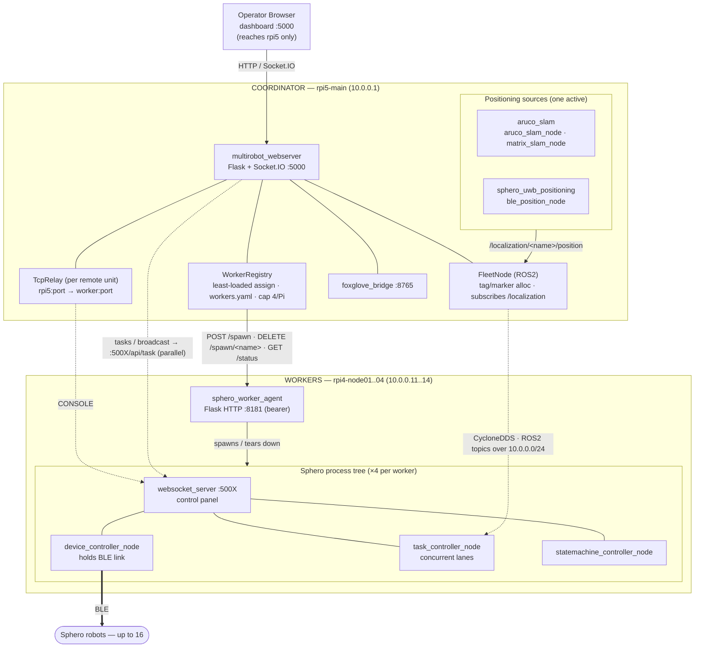

# sphero_ros2

ROS2 Rolling workspace for multi-robot Sphero control with UWB positioning, ArUco-based localization, and a central web dashboard.

## Packages

| Package | Purpose |
|---------|---------|
| `sphero_instance_controller` | Core multi-robot control. Per-instance namespaced topics (`sphero/<name>/*`), device/task/state-machine nodes. |
| `multirobot_webserver` | Central Flask + WebSocket dashboard for managing multiple Spheros from one browser. |
| `aruco_slam` | Camera-based localization for field calibration and robot tracking. Supports printed ArUco markers and active LED-matrix markers (blue-tape boundary calibration). |
| `sphero_uwb_positioning` | UWB ranging integration for Sphero positioning via Arduino tag/anchor hardware. |
| `sphero_worker_agent` | Per-Pi HTTP launcher agent for the distributed BLE worker fleet. Lets the webserver spawn/tear down Sphero instance trees on remote RPi4 workers. |

Hardware-side firmware (Arduino Portenta C33 + UWB Shield, Stella tags) lives under `arduino/`.

See [`doc/package.md`](doc/package.md) for detailed architecture, topic layout, message types, and state machine configuration.

## System Architecture

The fleet runs as a coordinator + worker cluster on a dedicated `10.0.0.0/24`
switched LAN. **rpi5-main** hosts the dashboard, fleet bookkeeping, and the
positioning sources; four **rpi4 workers** each drive ~4 Spheros over BLE (one
adapter saturates before 16). All boards share one NFS-mounted workspace and
discover each other's ROS 2 topics over CycloneDDS.



> **Shared fabric:** rpi5 NFS-exports `/home/svaghela/sphero_ros2`; every worker
> mounts the same path and runs the same built `install/`. ROS 2 discovery is
> `ROS_DOMAIN_ID=0` + `rmw_cyclonedds_cpp` over `eth0` on the `10.0.0.0/24` switch.

**Request flow.** The browser talks only to rpi5. Deploying a Sphero →
`WorkerRegistry` picks the least-loaded worker → rpi5 calls that worker's
`agent` (`POST /spawn`) → the agent launches the 4-process tree; the
`device_controller` holds the BLE link. Opening a unit's CONSOLE →
`TcpRelay` on rpi5 forwards to the worker's control panel (the worker LAN
is otherwise unreachable from the browser). Tasks/broadcasts fan out from
rpi5 to each unit's `:500X/api/task` in parallel; one active positioning
source publishes `/localization/<name>/position`, which `FleetNode` consumes.

## Quick Start

### Prerequisites
```bash
# ROS2 Rolling
pip3 install spherov2 flask flask-socketio python-socketio
```

### Build
```bash
colcon build
source install/setup.bash
```

### Run the Web Dashboard (recommended)
```bash
ros2 run multirobot_webserver multirobot_webapp
# Open http://localhost:5000 and add Spheros via the UI
```

### Run a Single Sphero Instance Directly
```bash
ros2 run sphero_instance_controller sphero_instance_device_controller_node.py \
    --ros-args -p sphero_name:=SB-3660
```

### Run ArUco Localization
```bash
ros2 run aruco_slam aruco_slam_node --ros-args \
    -p camera_id:=0 -p field_width_cm:=600.0 -p field_height_cm:=400.0
```

For more commands and debugging tips, see [`doc/development.md`](doc/development.md).

## Topic Architecture

Per-instance namespace: `sphero/<sphero_name>/*`

```
sphero/SB-3660/
├── led, roll, heading, speed, stop, matrix   (commands in)
├── state, sensors, battery, status            (data out)
└── state_machine/{config,status}              (FSM)

/aruco_slam/<sphero_name>/position             (PoseStamped, cm)
/localization/<sphero_name>/position           (PoseStamped, cm — neutral contract)
```

Hyphens in Sphero names become underscores in ROS2 node names.

### Positioning Sources

The webserver selects a positioning source per fleet from `none`, `aruco`,
`matrix`, or `uwb`:

- `none` — no external localization
- `aruco` — printed ArUco markers (`aruco_slam`), publishes `/aruco_slam/<name>/position`
- `matrix` — active LED-matrix markers (`aruco_slam` matrix node), publishes the
  neutral `/localization/<name>/position` contract
- `uwb` — UWB ranging (`sphero_uwb_positioning`)

See [`src/aruco_slam/README.md`](src/aruco_slam/README.md) for the ArUco and
matrix-marker workflows.

## Repo Layout

```
arduino/        Arduino firmware (Portenta C33, UWB Shield, Stella tags)
bin/            arduino-cli binary
doc/            Documentation (see doc/package.md, doc/development.md)
plans/          Design plans for past and ongoing work
scripts/        Standalone validation/utility scripts (ArUco, BLE UWB scan, blink_fleet.py)
src/            ROS2 packages (see Packages table above)
```

## Documentation

- [`doc/package.md`](doc/package.md) — architecture, topics, messages, FSM config
- [`doc/development.md`](doc/development.md) — build, run, debug, tests
- [`doc/AGENTS.md`](doc/AGENTS.md) — SME agent workflow
- [`doc/UWB_SYSTEM_COMPLETE.md`](doc/UWB_SYSTEM_COMPLETE.md), [`doc/UWB_LIBRARIES_INSTALLED.md`](doc/UWB_LIBRARIES_INSTALLED.md) — UWB system docs
- [`doc/ARDUINO_CLI_INSTALLATION_COMPLETE.md`](doc/ARDUINO_CLI_INSTALLATION_COMPLETE.md) — Arduino CLI setup
- [`doc/CLUSTER.md`](doc/CLUSTER.md) — cluster notes
- Per-package READMEs in `src/*/README.md`

## External Resources

- Sphero SDK: https://sdk.sphero.com/
- spherov2 library: https://github.com/artificial-intelligence-class/spherov2.py
- ROS2 docs: https://docs.ros.org/

---

**ROS2 Distribution**: Rolling
**Maintained by**: Siddharth Vaghela (siddharth.vaghela@tufts.edu)

**Disclaimer**: All code in this repository was written with assistance from Claude Code. Errors may exist; users assume the risk of using AI-generated code.
