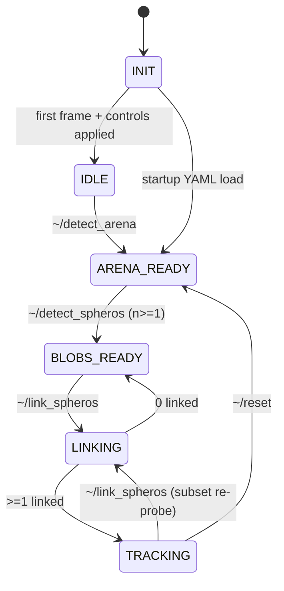

# Overhead tracking — algorithm design

How `overhead_tracking` turns a USB3 global-shutter camera into per-Sphero field
positions. Companion to the code in `src/overhead_tracking/`.

**Output contract (do not change):** `/localization/<name_safe>/position`,
`geometry_msgs/PoseStamped`, `frame_id='field'`, position in **centimetres**,
published every tick (`publish_rate_hz: 0`).
Consumed by `sphero_instance_device_controller_node.py:236-239` and
`sphero_instance_task_controller_node.py:949`.

---

## 1. Measured constants

Everything below is derived from real frames, not assumed.

| Quantity | Value | Where it matters |
|---|---|---|
| Ball diameter | 33–35 px | template, ROI size, `min_separation_px` |
| Matrix square | 26–32 px | template |
| Point-LED separation | 25.8–25.9 px | template, heading axis |
| Position stability (stationary) | ±1–2 px | the detector's noise floor |
| Candidate mask, 1920x1200 full-res | 31.6 ms | **the bottleneck** |
| Candidate mask, 1920x1200 at `detect_scale=2` | 5.2 ms | why the mask is downsampled |
| Bank match, one candidate | 0.93 ms | far cheaper than the mask |
| `detect_roi`, 1920x1200 + scale 2 | 17.1 ms | sets `track_rate_hz` |
| Full-frame `detect` | 786 ms | why full-frame is not used |
| Arena brightness, calibrated | p50 2–4 | `min_bright`, arena auto-detect |
| Camera | `auto_exposure=1, gain=100, AWB off` | `config/overhead_tracking.yaml` |

### Resolution: use 1920x1200, the full field of view

**1280x720 is not a downscale of 1920x1200 — it is a 1:1 centre crop.** Measured by
locating the 720p view inside a simultaneous 1200p capture: best match at **scale 1.00,
NCC 0.97, offset (316, 236)** — i.e. dead centre ((1920−1280)/2 = 320,
(1200−720)/2 = 240).

```
   1920x1200  (full sensor, ~85 deg)
   ┌───────────────────────────────────────────┐
   │                                           │
   │      ┌─────────────────────────────┐      │
   │      │   1280x720 sees only this   │      │  horizontal FOV: 66.7%
   │      │   40% of the sensor area    │      │  vertical   FOV: 60.0%
   │      └─────────────────────────────┘      │  area:           40.0%
   │                                           │
   └───────────────────────────────────────────┘
```

Because the crop is 1:1, **magnification is identical** — a robot is the same 34 px in
both modes. So 720p bought no extra detail; it simply discarded 60% of the arena. Every
template constant survived the switch unchanged.

The cost of the change is only the framerate ceiling (120 fps instead of 200) and 2.5×
the pixels in the candidate mask. The first is irrelevant — tracking runs at 30 Hz, and
the longer 8.3 ms frame period actually *raises* the exposure clamp. The second is
handled by `detect_scale`.

**Exposure is clamped by the frame period.** At 120 fps the period is 8.3 ms, so any
requested exposure above that is silently ignored — measured directly: 5000, 2000,
1000 and 500 all produced identical frames. Brightness is therefore tuned with
**gain**, not exposure.

**`CAP_PROP_FPS` must be set explicitly.** Not setting it does *not* mean "let the
camera run at its maximum" — OpenCV's V4L2 backend just defaults to 30 fps. Measured:
the node ran at 30 fps until this was set, which quadruples the exposure clamp to
33 ms and silently invalidates the brightness calibration. Raw `v4l2-ctl` behaves
differently, which is where the wrong assumption came from.

**Driver rate and consume rate are different numbers.** The *driver* frame interval
(`v4l2-ctl --get-parm`, currently 120 fps) is what sets the exposure clamp. The *consume*
rate — how fast the grab thread keeps up — is MJPEG-decode bound and measures ~52 fps at
1920x1200. That is expected and harmless (the tick only needs 30 Hz), but comparing the
consume rate against `camera_fps` produces a false "framerate drift" alarm. `~/state`
reports both separately and only the driver rate drives the warning.

---

## 2. Node topology

```
                    ┌──────────────────── overhead_tracker_node ────────────────────┐
 /dev/video0 ──────►│ V4L2Source (grab thread, fresh array per frame)               │
   MJPG 720p        │      │ latest_gray()                                          │
                    │      ▼                                                        │
                    │  _tick @ 30 Hz ──► predict ──► candidates ──► ROI claims      │
                    │      │                              │                         │
                    │      │                    ThreadPoolExecutor(cores)           │
                    │      │                     match_bank_at × N                  │
                    │      │                              │                         │
                    │      ▼                              ▼                         │
                    │  homography px→cm ──► gates ──► KF.update_camera (serial)     │
                    │      │                                                        │
    sphero/*/roll ─►│  roll command ──► KF control input (v, theta)                 │
 /sphero_fleet/  ──►│  roster                                                       │
                    │      │                                                        │
                    │      ├──► /localization/<name_safe>/position  @tick   [cm]    │
                    │      ├──► ~/track_markers          (metres, for 3D views)     │
                    │      └──► bounded FIFO ═══► annotate worker ──► ~/annotated/  │
                    └───────────────────────────────────────────────────────────────┘
```

One node, not the usual capture/algorithm split: 1280×720 mono at 200 fps is
**184 MB/s**, which is not something to push through DDS on a Pi 5. The camera is
owned through a duck-typed pull source (`start/on_tick/latest_gray/close`) so the sim
swap that made the split testable still works. The only image on the wire is the
annotated JPEG.

---

## 3. Operator state machine



Rules that carry weight:

- **`~/detect_arena` is refused while `TRACKING`.** A new homography under live
  tracks teleports every published position. `~/reset` first.
- **Failure never demotes state.** A failed detect leaves the previous good arena or
  blob snapshot intact and returns `success=false` with actionable diagnostics —
  a zero-blob result reports frame p50/p99 so you can tell "exposure got stomped"
  from "the robots aren't lit".
- **`LINKING` suppresses camera updates.** Probing flashes LEDs across the arena;
  a camera measurement taken then is a direct route to a baked-in ID swap. The KF
  dead-reckons, so the position output is unaffected.
- **`~/reset` keeps publishers.** Destroying rclpy entities from a service thread
  while the tick runs is a known hazard.

---

## 4. Arena → homography

The Spheros roll on a flat floor, so a single 3×3 homography from four corner pixels
to the measured rectangle is exact for an ideal pinhole and absorbs modest lens
distortion. No depth, no plane fit, no intrinsics.

```
  image pixels                          field centimetres
  ┌─────────────────┐                   (0,short) ┌──────────┐ (long,short)
  │   ●d        ●c  │                             │          │
  │                 │   ──── H ───►               │          │
  │ ●a          ●b  │                     (0,0)   └──────────┘ (long,0)
  └─────────────────┘
   origin = bottom-left IN IMAGE SPACE
   +x along the LONG edge, +y along the SHORT edge
```

Corner **adjacency** comes from ring topology (angle about the centroid), not pixel
distance: under a tilted camera, perspective compresses the far edge, so the diagonal
corner can be closer in pixels than a true neighbour. Ring order is projective and
survives that. Which edge is **long** is decided by pixel length — all we have in
image space — and `arena_swap_axes` is the escape hatch when perspective inverts it.
The service reports which edge it called long so the operator can see the choice.

`arena_source: manual` is the default because at the calibrated exposure the arena
reads p50 2–4 and there is no edge to detect. Auto-detection carries a real trap that
`max_quad_area_frac` guards: on a dark noisy frame Canny fires everywhere, the
morphological close merges it, and the external contour is the rectangle just inside
the suppressed border — yielding a confident, entirely bogus full-frame "arena".

---

## 5. Detection: colour-invariant shape matching

Each robot is a circular ball with a square LED matrix and two point LEDs on opposite
sides. The template encodes exactly that:

```
   41x41 template                bank: 12 rotations, 0-180 deg
   ┌─────────────┐               (the two point LEDs are
   │  ███████████│               indistinguishable in grayscale,
   │ ●███████████●│  ← points    so the pattern has 180 deg symmetry)
   │  ███████████│   ← matrix
   └─────────────┘   ← ball
```

Matching is `TM_CCOEFF_NORMED`, which is contrast-invariant — that is what lets a
robot be found **with its matrix switched off**, and it was confirmed live: the
highest-scoring detection in the validation frame (0.76) was a matrix-off robot.

The same invariance is a hazard. Ungated, the correlation locks onto arena noise:
74 false positives per frame, 5th-place score 0.634 against a true-robot 0.668. The
`min_bright` gate is therefore load-bearing, not an optimisation.

**Two-stage structure.** `bright_components` (mask + connected components) and
`match_bank_at` (rotation bank over one 48×48 window) are the two halves of the
validated `detect_roi`, exposed separately so the node can run the mask once per
frame and dispatch only the per-candidate half to a thread pool. `detect_roi` is
*defined* as their composition and a test asserts the two agree exactly, so the fast
path cannot drift from the thing that was measured.

---

## 6. Per-frame pipeline

```
T0   gate: state is TRACKING/LINKING and tracks exist
T1   snapshot gray, stamp          fresh = stamp changed
T2   dt from the FRAME ACQUISITION time, not wall-now       age = now - stamp
T3   for each track: kf.predict(dt)                          [serial, tick thread]
T4   comps = bright_components_scaled(gray, detect_scale)   ONE mask + CC   ~5 ms
       └─ drop components outside the arena polygon
T5   per track: forward-predict the ROI                      [pure, cheap]
T6   claim: components inside each ROI, greedy by distance to the prediction
       └─ one component to at most one track  ← conflicts resolved on CENTROIDS
T7   submit match_bank_at per claim         [thread pool, ~3 ms each, GIL released]
T8   accept/reject per track:                                [serial, tick thread]
       1. no result or score < thresh          -> miss
       2. px -> cm via homography
       3. outside arena + margin               -> OUT_OF_ARENA, reject, keep coasting
       4. |meas - pred| > innovation_gate_cm   -> reject, disagreement_count++
       5. two matches within min_separation_px -> keep the higher score
       6. kf.update_camera(x_cm, y_cm)         -> HEALTHY, miss_count = 0
T9   miss ladder: COASTING -> (max_misses) LOST -> (timeout) UNRESOLVED
T10  re-acquire LOST tracks against unclaimed components via associate()
T11  publish every tick (publish_rate_hz: 0); extrapolate by v*age WITHOUT
     mutating the filter
T13  hand (frame, labels, stamp) to the annotate queue
T14  diagnostics
```

**Why the candidate search is hoisted out of the ROI loop.** Taken literally, "crop a
3× ROI and match inside it" means a 102×102 window; `matchTemplate` with a 41×41
template over that produces a 62×62 response map — ~60× the work of the small window
the algorithm was validated with. The ROI is therefore used as a *claim region over
already-extracted components*, and the bank only ever runs on a 64×64 window. The ROI
geometry and forward prediction are unchanged; only the thing being searched differs.
Re-acquisition then costs nothing extra, because the candidates already exist.

**Where the time actually goes.** Measured, not assumed — and it is the opposite of
what you would guess. The 20×20 dilation in the candidate mask costs **31.6 ms** over
2.3 MP, while matching one candidate costs **0.93 ms**. The mask, not the matching, is
the bottleneck. Running only the mask at half resolution drops it to 5.2 ms and, on a
real frame, returns byte-identical detections — the centroid only has to be good enough
to centre the match window, and `candidate_pad_px` absorbs the rest.

Do not compensate by widening the pad much further: at `pad_extra=12` the larger
response map began admitting false positives (7 hits where 5 were real). `scale=2` with
`pad_extra=8` was exact.

### ROI forward prediction

```
        previous frame                     next frame prediction
   ┌─────────────────────┐            ┌─────────────────────────┐
   │      ROI (3×D)      │            │   ROI recentred on the  │
   │    ┌─────────┐      │            │   KF-predicted pixel    │
   │    │  ● ball │      │   ──v──►   │    ┌─────────┐          │
   │    └─────────┘      │            │    │   ●     │          │
   └─────────────────────┘            └─────────────────────────┘
        half = 51 px                    half grows with |v|·dt
                                        and 1.5^miss_count
```

```python
u_pred, v_pred = field_cm_to_px(kf.predict(dt), H_inv)
scale          = px_per_cm_at(u_pred, v_pred, H)      # local Jacobian
half           = clamp(roi_scale * ball_d / 2 + ceil(|v| * scale * dt)
                       * roi_growth ** miss_count, lo, hi)
```

Extrapolation happens in **cm** and only then maps to pixels — px/cm varies across
the frame under perspective, so extrapolating a pixel velocity would be wrong. The
velocity comes from the KF, whose (v, theta) rows are set outright by the last
**roll command** rather than inferred from successive camera fixes. That is what makes
the window trustworthy during occlusion: the command is known even when the robot is
not visible.

---

## 7. Motion model

4-state linear Kalman filter per robot, field frame, cm (`motion.py`):

```
state    x = [ px, py, v, theta ]      cm, cm, cm/s, deg CCW from +x
control  u = (v_cmd, theta_cmd)        the last roll command, in field terms
meas     z = [ x_cm, y_cm ]            template match through the homography
```

- **Camera** gives absolute (px, py), only when a blob is associated.
- **The roll command supplies (v, theta) outright.** `F` is identity on position and
  zero on (v, theta): those two rows come entirely from the control, so position
  integrates the *commanded* velocity instead of waiting for successive camera fixes
  to reveal that the robot moved. `cmd_speed_to_cms` converts the Sphero `speed`
  field (0–255) to cm/s; Sphero headings are clockwise-positive and field angles
  counter-clockwise, so the field heading is the negation.
- **Robot telemetry is not an input.** The IMU/odometry fusion path (a 13-state
  filter over velocity, orientation, accel and gyro) was removed 2026-08-31 along
  with `fusion.py`. It made a bad body-frame velocity or yaw indistinguishable from a
  detection failure: a wrong telemetry reading dragged the prediction, and the ROI
  with it, away from where the robot actually was. Telemetry position was never
  fusable anyway — the device controller feeds our own `/localization` output back
  into its reported x,y, so fusing it would have been circular.
- A missing blob means predict-only, and we **still publish**. Downstream has no
  "invalid" path, so a slightly stale pose beats a gap in the stream.

Heading comes from the **camera** (`_camera_heading`, the LED spine/back-LED read),
not from telemetry yaw. `use_template_heading: false` keeps the raw template angle out
of it: that angle oscillates 60–120° when the matrix is off, and the 15° bank quantises
it regardless. It is reported for display only.

---

## 8. Threading

| Thread | Work |
|---|---|
| Camera grab (daemon) | `cap.read()`, gray convert, publish a **fresh array** |
| Tick (MutuallyExclusive) | predict, claims, gates, **all KF math**, publish, handoff |
| Match pool (`min(4, cores)`) | `match_bank_at` per candidate |
| Annotate worker (daemon) | draw + JPEG encode + publish, fed by a bounded FIFO |
| Services (MutuallyExclusive) | arena / blobs / link / reset — these block for seconds |
| Subs (Reentrant) | roster, roll/stop commands, compass |

`cv2.setNumThreads(1)` before construction, or OpenCV's internal parallel-for
oversubscribes the cores against the pool and the threading becomes a net loss.

**The pool is sized to cores, not blobs.** `match_bank_at` is CPU-bound OpenCV with
the GIL released. Sixteen threads for sixteen robots does not run sixteen matches at
once — it runs 4 with 12 descheduled, for identical throughput plus context switches.
Wall time is `ceil(16/cores) × 0.93 ms ≈ 4 ms` either way.

Full budget at 1920x1200, 16 robots, 30 Hz (33 ms): ~5 ms mask + ~4 ms matching +
executor and annotate overhead. Comfortable, and the mask dominates — which is why
`detect_scale` matters more than `match_workers` does.

Three invariants remove the need for finer locking:

1. **Published frames are immutable.** The grab thread allocates a fresh array per
   frame, so pool workers take zero-copy views and the annotate queue holds
   references rather than copies. Corollary: a queued entry pins its frame, so the
   queue bound is also the memory bound.
2. **`FusionKF` objects are tick-thread-only.** Linking fully initialises a filter
   *then* inserts it; nothing else ever touches one.
3. **Per-robot publishers/subscriptions are created only from the service thread.**
   Concurrent entity creation on one node is not thread-safe in rclpy — a test
   asserts the tick creates none.

### Annotation handoff

```
   tick thread                      annotate worker (daemon)
   ───────────                      ────────────────────────
   build label dict                   item = queue.get()
   queue.put_nowait(...)              draw_overlay(...)            ~2 ms
   └─ Full? degrade, then drop        encode_jpeg(...)             ~3-8 ms
   return immediately                 publish CompressedImage
```

Bounded FIFO (default 5 ≈ 0.33 s ≈ 4.5 MB), not latest-wins: a frame whose labels
were already computed should not be discarded because the encoder was briefly busy.
Under sustained overload the worker **degrades before dropping** — `jpeg_quality`
down to `annotate_min_quality`, then `annotate_scale` to 0.5 — so a non-zero
`annotate_drops` is a genuine overload signal rather than routine behaviour. Each
entry carries its own acquisition stamp, so a late-published frame is still
time-truthful in a bag.

---

## 9. Failure modes

| Mode | Handling |
|---|---|
| **Occlusion** | miss → `COASTING`, ROI grows 1.5×/miss, KF dead-reckons on the last roll command. The tracker set is fixed at link time, so an occluded robot can never be replaced by a phantom. |
| **Two robots overlapping** | claims resolved on centroids before matching; post-match exclusivity within 34 px; the loser dead-reckons on its own commanded velocity, which carries identity through the merge; re-acquisition suppressed during overlap. |
| **Leaving the arena** | measurement rejected, status `OUT_OF_ARENA`, **publishing continues**. |
| **Dropped frames** | stale stamp → predict-only, still publish. >1 s warn; >5 s reopen **and re-arm the control re-apply**, because the UVC exposure discard happens on every stream start. |
| **Framerate drift** | warn — fps sets the exposure clamp, so a drop to 60 fps silently triples exposure. |
| **Matrix off** | still tracked (contrast-invariant matching); the template angle is unreliable, hence camera LED heading. A fully dark robot falls into the occlusion path. |
| **ID swap** | ROI containment → centroid conflict resolution → post-match exclusivity → innovation gate → `SUSPECT` after 20 disagreements. **Never auto-corrected**: repair is operator-driven `~/link_spheros ["A","B"]`, because auto-swapping on camera-only evidence is how a swap becomes silent and permanent. |

---

## 10. Interface summary

**Services** — `~/detect_arena`, `~/detect_spheros` (`std_srvs/Trigger`),
`~/link_spheros` (`multirobot_msgs/srv/Register`), `~/reset`,
`~/reapply_camera_controls`.

**Published** — `/localization/<name_safe>/position` (PoseStamped, cm, every tick
at `publish_rate_hz: 0`), `~/detections` (String JSON: per-robot pixel u/v, field
x/y, heading, score, status), `~/annotated/compressed` (CompressedImage jpeg,
acquisition stamp), `~/arena_corners` (Marker, metres, latched), `~/track_markers`
(MarkerArray, metres), `~/state` and `~/link_status` (String JSON, latched),
`sphero/<name_safe>/{led,matrix,heading,reset_aim,calibrate_compass}`.

**Subscribed** — `/sphero_fleet/robots` (FleetState, latched),
`sphero/<name_safe>/roll`, `sphero/<name_safe>/stop`,
`sphero/<name_safe>/calibrate_compass_done`.

Units: `/localization` and all internal field maths are **centimetres**; markers and
TF are **metres**. The split is deliberate and matches the existing control-stack
contract.
