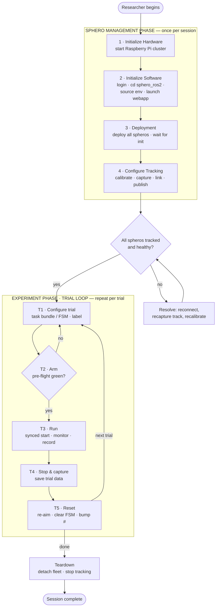
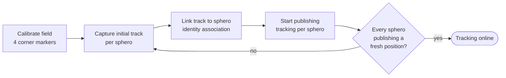
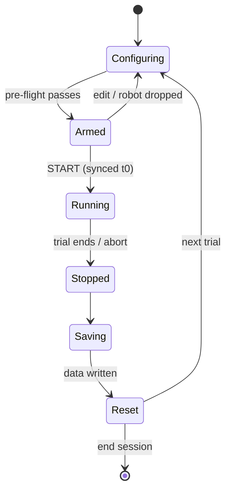
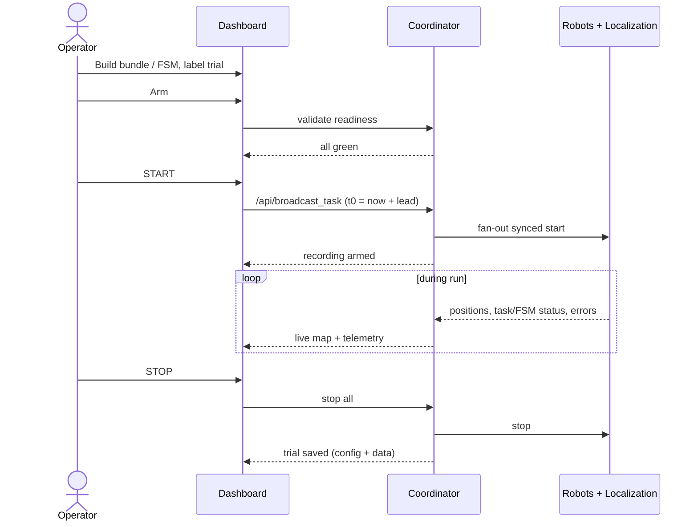

# Operator Interaction Flow

Status: **Draft / working design** — this document records the intended operator
workflow for the `multirobot_webserver` (the "Sphero Control Station"). It is the
reference we are using to streamline the dashboard. Items marked **TBD** are open
decisions, not yet settled.

## Purpose & scope

This describes what a **single operator at one screen** does to run multi-robot
Sphero experiments, step by step, and **what information must be visible at each
step**. The target experiment involves:

- **Scripted task bundles** — synchronized multi-robot choreography (roll, patrol,
  circle, etc.) broadcast with a shared start time.
- **State-machine behaviors** — per-robot FSM configs driving autonomous behavior.
- **Data collection across repeated trials** — each run is a trial whose data is
  captured for later analysis.

It is written against the system as it exists today (see `doc/package.md`), and it
flags where the current dashboard does not yet support a step. It is a **design
target**, not a description of current behavior.

---

## Mental model: Session vs. Trial

The workflow is **not** a single linear sequence. It splits into two macro-phases:

- **Sphero Management Phase** — set up **once** per session: hardware up, software
  up, fleet deployed, tracking configured and publishing. Stable across many trials.
  Once it is green, it should *fade into the background*.
- **Experiment Phase (Trial Loop)** — the unit you **repeat**: configure behavior →
  arm → run → capture → reset. This is the loop we want tight enough to run dozens
  of times in an afternoon.

Streamlining the dashboard = making management state recede once healthy, and making
the trial loop a gated, low-friction cycle.

---

## Sphero Management Phase (do once per session)

This is the researcher's real setup sequence. It ends when every sphero is deployed,
tracked, and publishing a position — the system is then ready for trials.

### 1 · Initialize Hardware

Bring the physical compute platform up.

- **Operator actions:** start the Raspberry Pi cluster (coordinator + worker Pis).
- **Information to surface:** which cluster nodes are powered and reachable; cluster
  online count.
- **Gate to advance:** all intended cluster nodes reachable.
- **Backend mapping:** distributed mode runs a worker agent per Pi; the coordinator
  selects workers via the worker registry (`config/workers.yaml`).
- **Current gap:** this happens entirely outside the dashboard (physical / network).
  The dashboard has **no cluster-health view**, so "is the cluster up?" is answered
  off-screen today.

### 2 · Initialize Software

Get the control station process running and reachable.

- **Operator actions:** log in to the Pi cluster (SSH); `cd` to `sphero_ros2`; source
  the ROS 2 + workspace environment; launch `multirobot_webapp`.
- **Information to surface:** webapp up (port 5000 reachable, link NOMINAL); worker
  agents registered/checked in; default positioning source; Foxglove bridge up.
- **Gate to advance:** dashboard loads and shows a live link to the coordinator.
- **Backend mapping:** Flask app + `FleetNode` on port 5000; reads `workers.yaml`
  for distributed spawn; Foxglove bridge self-starts.
- **Current gap:** multi-step CLI with no single launch command, and no readiness
  summary confirming all workers checked in. The "uptime" chip is a cosmetic browser
  timer, not backend uptime.

### 3 · Deployment

Add every sphero and wait for it to come up.

- **Operator actions:** enter all callsigns (one per line, e.g. `SB-3660`); deploy
  the batch; **wait for each to initialize**. Tags/ports auto-assigned.
- **Information to surface, per robot:** connection state (STARTING → RUNNING);
  **battery %**; assigned tag_id; failed callsigns called out explicitly.
- **Gate to advance:** every deployed robot is `running` and BLE-connected.
- **Backend mapping:** batch deploy spawns a 4-process tree per robot (device, task,
  state-machine controllers + per-robot websocket server), locally or via a worker
  agent, and registers it with `FleetNode`.
- **Current gap:** **battery is collected but never shown on the dashboard** — a low
  robot is invisible until it dies mid-trial. Device errors (`ble_lost`,
  `connect_failed`) reach only that robot's own console tab, not the coordinator, so
  a drop shows up centrally as a vague "link lost" at best. "Wait for init" has no
  explicit per-robot ready signal beyond the polled status.

### 4 · Configure Tracking

Calibrate the field, then for each sphero capture a track, bind that track to the
sphero's identity, and begin publishing its position. This is the step that turns a
pile of connected robots into a *localized fleet*.

- **4a · Calibrate field** — establish the field-frame coordinate system.
  - *Info:* calibration status (calibrated yes/no), all 4 corner markers seen,
    field dimensions.
- **4b · Capture initial track per sphero** — the camera detects candidate tracks;
  the operator captures one as the starting track for a given sphero.
  - *Info:* detected/candidate tracks, which are still unassigned, the captured
    track's position.
- **4c · Link track to sphero** — bind each captured track to a sphero callsign
  (identity association).
  - *Info:* the track ↔ callsign mapping, any tracks or robots still unlinked.
- **4d · Start publishing tracking per sphero** — begin emitting each sphero's
  position on `/localization/<robot>/position`.
  - *Info:* per-robot position now live, `last_seen` fresh, confidence OK.
- **Gate to advance (into the trial loop):** every sphero has a linked track that is
  publishing a fresh position; field is calibrated.
- **Backend mapping:** camera-based source (ArUco / MATRIX) publishing the shared
  `/localization/<robot>/position` contract (cm, `field` frame); marker/track pool
  via `/api/markers`. `FleetState` aggregates pose/heading/last_seen.
- **Current gap / open question:** the explicit **capture → link → publish** per-robot
  association is not exposed as distinct steps in the dashboard today. ArUco uses
  fixed marker IDs (10–13) where identity is baked into the marker — no manual link.
  A capture-and-link flow implies a different tracking mechanism (e.g. MATRIX / track
  identity assignment). **See open decision #5 — the exact tracking mechanism and how
  linking works need confirmation before this phase can be designed precisely.**

> **End of the Sphero Management Phase.** The fleet is deployed, tracked, and
> localized — the system is ready to run trials.

---

## Experiment Phase — Trial loop (repeat per trial)

### T1 · Configure trial

Define what will run and give the trial an identity so its data is meaningful.

- **Operator actions:** build the task bundle (lanes: DRIVE / AIM / THROTTLE /
  LED / MATRIX / CONFIG) and/or push per-robot FSM configs; set lead seconds and
  per-card offsets; **name/label the trial**.
- **Information to surface:** what is assigned to whom; lane conflicts (blocking);
  the trial's identity (number, label, **config snapshot** that will be recorded).
- **Gate to advance:** no lane conflicts; a valid behavior is assigned.
- **Backend mapping:** task bundles → `/api/broadcast_task`; FSM configs →
  per-robot `state_machine/config`.
- **Current gap:** advanced params are edited through a blocking `window.prompt`
  with no validation until submit. No notion of a named/snapshotted trial exists.

### T2 · Arm

Confirm "this exact thing is about to run," and cheaply re-validate readiness (a
robot may have dropped since the last trial).

- **Operator actions:** review the pre-flight summary; arm.
- **Information to surface:** N robots ready, behavior assigned, **recording armed**;
  any robot that fell out of ready state since S3.
- **Gate to advance:** pre-flight green. **TBD:** hard gate (cannot START until
  green) vs. soft warning the operator can override.
- **Backend mapping:** re-reads `FleetState` readiness; no command sent yet.
- **Current gap:** there is no arm step and no pre-flight summary today.

### T3 · Run

Start synchronized, watch it happen, record it, and be able to abort.

- **Operator actions:** START (synchronized t0 = now + lead); monitor; ABORT if
  needed.
- **Information to surface:** **live position map** (absent today); per-robot
  task/FSM status; device errors as they happen; battery; **a recording indicator
  and the real trial clock**.
- **Gate to advance:** trial completes or is aborted.
- **Backend mapping:** `/api/broadcast_task` stamps one `t0` and fans out to each
  robot's websocket server; controllers wait until `t0 + offset` (NTP-dependent
  sync). Live telemetry already flows into `FleetNode`.
- **Current gap:** **no positional/telemetry view in the browser** — the run is
  effectively flown blind from the dashboard. Recording does not exist.

### T4 · Stop & capture

End the trial and persist its data with enough metadata to be useful later.

- **Operator actions:** STOP all; confirm the trial was saved.
- **Information to surface:** did it complete cleanly; errors during the run;
  **confirmation the trial data was written** (config + metadata + recorded
  streams).
- **Gate to advance:** data written.
- **Backend mapping:** **TBD** — see *Open decisions*. No recorder exists; this is
  net-new and likely a ROS-side component.
- **Current gap:** entirely absent. This is the highest-value missing piece for the
  stated experiment.

### T5 · Reset → back to T1

Return the fleet to a known starting condition for the next trial.

- **Operator actions:** re-aim / return robots to start; clear FSM; bump the trial
  counter.
- **Information to surface:** robots back to known start state; batteries still OK
  (or "swap SB-XXXX"); next trial number.
- **Gate to advance:** fleet ready → loop to T1, or exit to teardown.
- **Backend mapping:** `reset_aim` / `state_machine/control` (clear) per robot.
- **Current gap:** no "reset for next trial" concept; the operator improvises.

---

## Teardown

- **Operator actions:** detach the fleet; stop tracking; (optionally) stop the
  stack and shut down the cluster.
- **Information to surface:** all robots detached; tracking stopped; where the
  session's trial data lives.
- **Backend mapping:** batch detach tears down each robot's process tree;
  positioning/tracking source stop.

---

## One trial, end to end

---

## Open decisions (TBD)

These shape the design and are not yet settled:

1. **Data capture — the big one.** What must come out of each trial? Candidates:
   per-robot position time-series, FSM state transitions, task lifecycle events,
   collision/tap events, plus a config snapshot. At what rate, in what format
   (rosbag? CSV/JSON?), stored where, and what is done with it afterward (plots,
   replay, stats)? This drives T1–T4 and likely a new ROS-side recorder.
2. **Arm gate strictness.** Hard gate (cannot START until all green) vs. soft,
   overridable warning. Solo-operator context could justify either.
3. **Re-deploy frequency.** Does the Session/Trial split hold — set up once, run
   many trials — or are robots often re-deployed between trials (which would pull
   parts of S2/S3 into the loop)?
4. **Live view scope.** Minimum viable run monitor: position map only, or
   map + per-robot status + battery + errors in one view?
5. **Tracking mechanism & linking (Phase 4).** How does *capture → link → publish*
   actually work? ArUco today bakes identity into fixed marker IDs (10–13) with no
   manual link, so the capture-and-link flow implies a different mechanism (MATRIX /
   manual track-identity assignment). Need: what the camera detects as a "track,"
   how the operator captures and binds it to a callsign, and what "start publishing"
   toggles. This determines the entire Phase 4 design.

---

Maintained alongside `doc/package.md` and `doc/development.md`.
