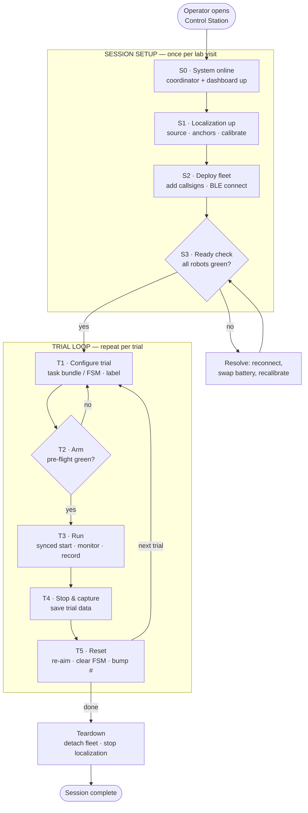
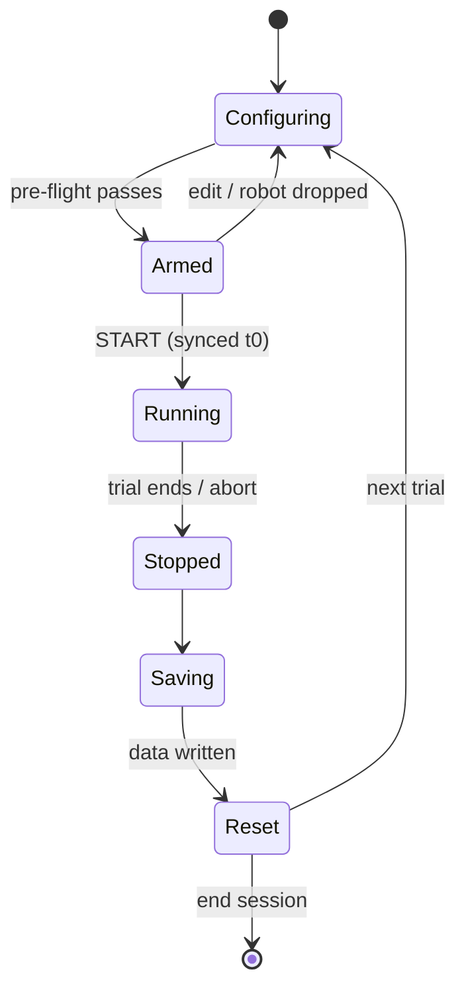
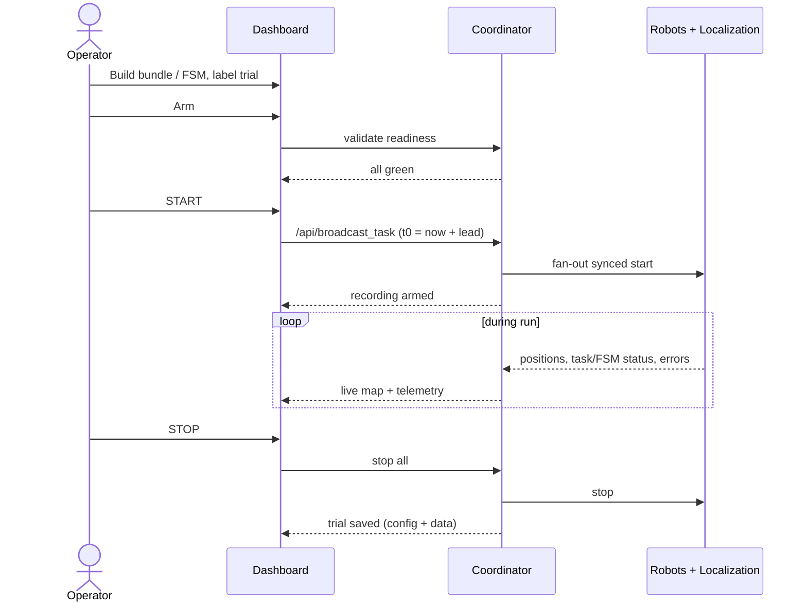

# Operator Interaction Flow

Status: **Draft / working design** — this document records the intended operator
workflow for the `multirobot_webserver` (the "Sphero Control Station"). It is the
reference we are using to streamline the dashboard. Items marked **TBD** are open
decisions, not yet settled.

## Purpose & scope

This describes what a **single operator at one screen** does to run multi-robot
Sphero experiments, step by step, and **what information must be visible at each
step**. The target experiment involves:

- **Scripted task bundles** — synchronized multi-robot choreography (roll, patrol,
  circle, etc.) broadcast with a shared start time.
- **State-machine behaviors** — per-robot FSM configs driving autonomous behavior.
- **Data collection across repeated trials** — each run is a trial whose data is
  captured for later analysis.

It is written against the system as it exists today (see `doc/package.md`), and it
flags where the current dashboard does not yet support a step. It is a **design
target**, not a description of current behavior.

---

## Mental model: Session vs. Trial

The workflow is **not** a single linear sequence. Because the work is *repeated
trials with data capture*, it is a short, fast **loop** nested inside a one-time
**setup**.

- **Session** — set up **once** per lab visit: localization online, fleet deployed
  and connected. Stable across many trials. Once it is green, it should *fade into
  the background*.
- **Trial** — the unit you **repeat**: configure behavior → arm → run → capture →
  reset. This is the loop we want tight enough to run dozens of times in an
  afternoon.

Streamlining the dashboard = making Session state recede once healthy, and making
the Trial loop a gated, low-friction cycle.

---

## Session setup (do once)

### S0 · System online

Bring the control station up and confirm the operator is talking to a live backend.

- **Operator actions:** launch the coordinator stack; open the dashboard.
- **Information to surface:** backend link state (NOMINAL / NO LINK); active
  positioning source on boot; whether Foxglove bridge is up.
- **Gate to advance:** dashboard shows a live link to the coordinator.
- **Backend mapping:** coordinator Flask app + `FleetNode` (port 5000); link state
  is inferred from the status poll succeeding.
- **Current gap:** several pieces (Foxglove bridge, sometimes the whole stack) are
  started from the CLI / launch files rather than from one operator action. The
  "uptime" chip is a cosmetic browser timer, not backend uptime.

### S1 · Localization up

Choose and start the position source the trials will use, and confirm it is
actually producing positions.

- **Operator actions:** pick source (NONE / ARUCO / MATRIX / UWB); for UWB, enter
  and **save the 4 anchor coordinates** (cm) before starting; set camera id for
  ArUco/Matrix; start the source.
- **Information to surface:** source state (running?); ArUco `calibrated` flag (all
  4 field corners seen); UWB anchors configured? live or fake mode?; **field-ready:
  yes/no**.
- **Gate to advance:** the source is not merely "started" but **emitting positions**
  on `/localization/<robot>/position`.
- **Backend mapping:** single-active-publisher rule — selecting a source stops the
  others. ArUco auto-calibrates when all 4 corners are visible; UWB requires manual
  anchors first and does not auto-start.
- **Current gap:** the UI shows "started" but not "actually localizing." Anchor edits
  do **not** apply to a running UWB node — positioning must be restarted, and the UI
  only says so in a transient toast. Standalone START/STOP ARUCO/UWB buttons overlap
  confusingly with the source selector (and there is no MATRIX start/stop button).

### S2 · Deploy fleet

Add the robots for this session and get them connected over BLE.

- **Operator actions:** enter callsigns (one per line, e.g. `SB-3660`); deploy the
  batch. Tags/ports are auto-assigned.
- **Information to surface, per robot:** connection state (STARTING / RUNNING /
  STOPPED); **battery %**; assigned tag_id. Failed callsigns called out explicitly.
- **Gate to advance:** every intended robot is `running` and BLE-connected.
- **Backend mapping:** batch deploy spawns a 4-process tree per robot (device, task,
  state-machine controllers + per-robot websocket server) and registers it with
  `FleetNode`.
- **Current gap:** **battery is collected but never shown on the dashboard** — a
  low robot is invisible until it dies mid-trial. Device errors (`ble_lost`,
  `connect_failed`) reach only that robot's own console tab, not the coordinator, so
  a drop shows up centrally as a vague "link lost" at best.

### S3 · Ready check — the gate into the trial loop

The bridge from Setup to repeatable trials. Once green, the operator stops thinking
about Setup.

- **Operator actions:** review the readiness board; resolve anything not green
  (reconnect, swap battery, recalibrate field) and re-check.
- **Information to surface, per robot, all green:** has a **fresh position**
  (`last_seen` recent); **battery above threshold**; localization confidence OK;
  controller healthy.
- **Gate to advance:** all deployed robots pass; field is calibrated.
- **Backend mapping:** data exists in `FleetState` (pose, battery, heading, tag_id,
  last_seen) but is published only to ROS2/Foxglove today.
- **Current gap:** **this gate does not exist.** Nothing prevents starting a run
  before robots are localized or charged. There is no unified position-confidence
  value (UWB computes covariance but discards it).

---

## Trial loop (repeat per trial)

### T1 · Configure trial

Define what will run and give the trial an identity so its data is meaningful.

- **Operator actions:** build the task bundle (lanes: DRIVE / AIM / THROTTLE /
  LED / MATRIX / CONFIG) and/or push per-robot FSM configs; set lead seconds and
  per-card offsets; **name/label the trial**.
- **Information to surface:** what is assigned to whom; lane conflicts (blocking);
  the trial's identity (number, label, **config snapshot** that will be recorded).
- **Gate to advance:** no lane conflicts; a valid behavior is assigned.
- **Backend mapping:** task bundles → `/api/broadcast_task`; FSM configs →
  per-robot `state_machine/config`.
- **Current gap:** advanced params are edited through a blocking `window.prompt`
  with no validation until submit. No notion of a named/snapshotted trial exists.

### T2 · Arm

Confirm "this exact thing is about to run," and cheaply re-validate readiness (a
robot may have dropped since the last trial).

- **Operator actions:** review the pre-flight summary; arm.
- **Information to surface:** N robots ready, behavior assigned, **recording armed**;
  any robot that fell out of ready state since S3.
- **Gate to advance:** pre-flight green. **TBD:** hard gate (cannot START until
  green) vs. soft warning the operator can override.
- **Backend mapping:** re-reads `FleetState` readiness; no command sent yet.
- **Current gap:** there is no arm step and no pre-flight summary today.

### T3 · Run

Start synchronized, watch it happen, record it, and be able to abort.

- **Operator actions:** START (synchronized t0 = now + lead); monitor; ABORT if
  needed.
- **Information to surface:** **live position map** (absent today); per-robot
  task/FSM status; device errors as they happen; battery; **a recording indicator
  and the real trial clock**.
- **Gate to advance:** trial completes or is aborted.
- **Backend mapping:** `/api/broadcast_task` stamps one `t0` and fans out to each
  robot's websocket server; controllers wait until `t0 + offset` (NTP-dependent
  sync). Live telemetry already flows into `FleetNode`.
- **Current gap:** **no positional/telemetry view in the browser** — the run is
  effectively flown blind from the dashboard. Recording does not exist.

### T4 · Stop & capture

End the trial and persist its data with enough metadata to be useful later.

- **Operator actions:** STOP all; confirm the trial was saved.
- **Information to surface:** did it complete cleanly; errors during the run;
  **confirmation the trial data was written** (config + metadata + recorded
  streams).
- **Gate to advance:** data written.
- **Backend mapping:** **TBD** — see *Open decisions*. No recorder exists; this is
  net-new and likely a ROS-side component.
- **Current gap:** entirely absent. This is the highest-value missing piece for the
  stated experiment.

### T5 · Reset → back to T1

Return the fleet to a known starting condition for the next trial.

- **Operator actions:** re-aim / return robots to start; clear FSM; bump the trial
  counter.
- **Information to surface:** robots back to known start state; batteries still OK
  (or "swap SB-XXXX"); next trial number.
- **Gate to advance:** fleet ready → loop to T1, or exit to teardown.
- **Backend mapping:** `reset_aim` / `state_machine/control` (clear) per robot.
- **Current gap:** no "reset for next trial" concept; the operator improvises.

---

## Teardown

- **Operator actions:** detach the fleet; stop localization; (optionally) stop the
  stack.
- **Information to surface:** all robots detached; sources stopped; where the
  session's trial data lives.
- **Backend mapping:** batch detach tears down each robot's process tree;
  positioning source stop.

---

## One trial, end to end

---

## Open decisions (TBD)

These shape the design and are not yet settled:

1. **Data capture — the big one.** What must come out of each trial? Candidates:
   per-robot position time-series, FSM state transitions, task lifecycle events,
   collision/tap events, plus a config snapshot. At what rate, in what format
   (rosbag? CSV/JSON?), stored where, and what is done with it afterward (plots,
   replay, stats)? This drives T1–T4 and likely a new ROS-side recorder.
2. **Arm gate strictness.** Hard gate (cannot START until all green) vs. soft,
   overridable warning. Solo-operator context could justify either.
3. **Re-deploy frequency.** Does the Session/Trial split hold — set up once, run
   many trials — or are robots often re-deployed between trials (which would pull
   parts of S2/S3 into the loop)?
4. **Live view scope.** Minimum viable run monitor: position map only, or
   map + per-robot status + battery + errors in one view?

---

Maintained alongside `doc/package.md` and `doc/development.md`.
